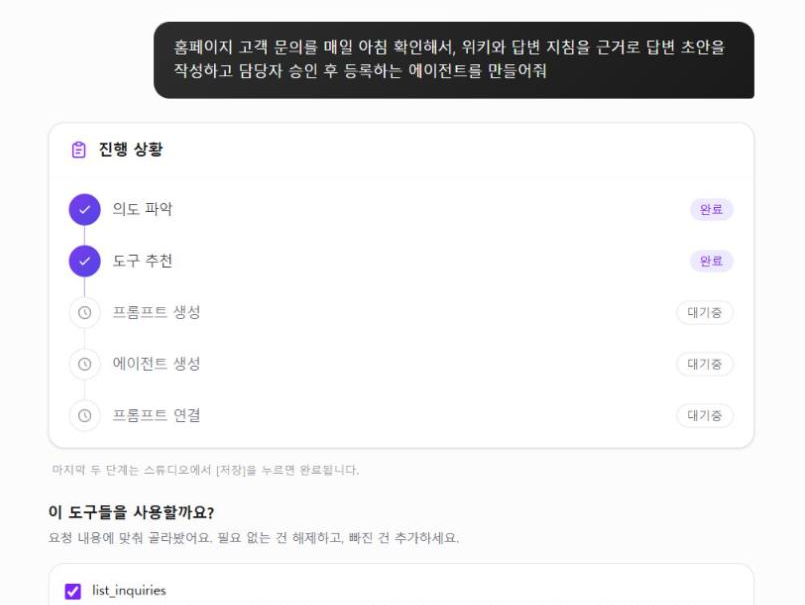

# sangplusbot

> 자연어 대화만으로 **실제 일하는 에이전트**를 만드는 Agent Builder 플랫폼

만들고 싶은 에이전트를 대화로 설명하면, 빌더가 필요한 도구·지식·지침을 골라 에이전트를 구성합니다.
이렇게 만든 에이전트는 사내 MCP 서버에 연결되어 메일·고객 문의 같은 실제 업무를 처리합니다.



### 자연어 빌더로 만든 에이전트

- **Outlook 메일 에이전트**: Outlook MCP로 메일을 조회하고 발송합니다. 사용자별 메일함을 분리해 본인 메일함에만 접근합니다.
- **홈페이지 문의 답변 에이전트**: 고객 문의를 읽고 위키·지침을 근거로 답변 초안을 작성합니다. 담당자가 승인하면 답변이 등록됩니다.

만든 에이전트는 스케줄로 정해진 시간에 자동 실행할 수 있고,
메일 발송·답변 등록처럼 외부로 나가는 작업은 사람이 승인한 뒤에만 실행됩니다.

### 쓸수록 똑똑해지는 구조

- **메모리**: 사용자·부서 정보를 저장해 질문마다 자동으로 반영
- **피드백**: 답변 평가를 지식 보강에 반영
- **위키**: 승인된 지식을 위키로 관리하고 답변 근거로 우선 사용

### 설계 원칙

- **근거 없으면 답하지 않는다** — 미근거 = 공란, 출처 인용 우선
- **LLM은 제안, 사람이 확정** — 메모리·위키 승격, 위험 도구 실행은 승인 게이트를 거침
- **모델은 고정, 데이터가 성장** — 피드백 → 메모리/위키로 지식이 자라는 성장 루프
- **일반화 우선** — 도메인 특화는 KB·에이전트 구성 데이터로 담고, 코어에 하드코딩하지 않음

---

## 주요 기능


| 영역                | 내용                                                                  |
| ----------------- | ------------------------------------------------------------------- |
| **자연어 Agent Builder** | 대화형(인터뷰) 에이전트 생성, 자연어 컴포저, 에이전트 실행·구독·포크, 스킬·도구·미들웨어 부착              |
| **도구 / MCP**      | MCP 서버 레지스트리, 도구 카탈로그, 시크릿 암호화(Fernet), 사용자별 신원 헤더(개인 메일함 등)             |
| **스케줄·자동화**           | 에이전트 스케줄 실행(외부 cron 트리거), 웹훅, 백그라운드 잡                                  |
| **승인 게이트**        | 위험 도구 호출 시 사람 승인(수정 후 승인 포함), 근거(grounding) 검증                      |
| **멀티 에이전트**       | LangGraph supervisor/worker 오케스트레이션, 서브에이전트 컨텍스트 전달                 |
| **성장 루프**         | 사용자/조직 메모리, LLM 위키(draft → 관리자 승인), 👍/👎 피드백 환류                    |
| **지식베이스 (KB)**    | PDF/엑셀 업로드, 파서 라우팅, parent-child·조항·커스텀 청킹, 콘텐츠 브라우저, 리트리버 테스트      |
| **RAG 검색**        | 하이브리드(Qdrant 벡터 + Elasticsearch 키워드), Kiwi 형태소 인덱싱, 계층 요약 기반 라우팅 검색 |
| **General Chat**  | 웹검색·문서검색·MCP 도구 통합 대화, WebSocket 스트리밍, 차트 시각화                       |
| **문서 생성**         | 문서 템플릿 슬롯 추출, 골든 샘플 블루프린트, Excel/PDF 내보내기                           |
| **평가·관측**         | RAGAS 평가·스윕, Agent Run 추적(노드·도구·LLM 호출·검색근거·비용), 관리자 대시보드           |
| **인증/인가**         | 가입 승인, JWT, RBAC, 부서 기반 접근제어, PII 마스킹                               |


> 기능별 상세는 [`docs/SOURCE-OF-TRUTH.md`](docs/SOURCE-OF-TRUTH.md)를 참고하세요.

---


## 기술 스택


| 구분                          | 스택                                                                                      |
| --------------------------- | --------------------------------------------------------------------------------------- |
| **Backend** (`idt/`)        | Python 3.11+, FastAPI, LangGraph / LangChain, SQLAlchemy 2.0 (async, asyncmy), Thin DDD |
| **Frontend** (`idt_front/`) | React 19, TypeScript, Vite, Zustand, TanStack Query, Tailwind CSS 4, React Flow         |
| **Storage**                 | MySQL (Flyway 마이그레이션), Qdrant, Elasticsearch 8.10, Redis                                |
| **LLM**                     | OpenAI / Anthropic / Ollama (provider 추상화, 모델 레지스트리)                                    |
| **Test**                    | pytest · pytest-asyncio / Vitest · React Testing Library · MSW                          |


---


## 프로젝트 구조

```
.
├── idt/                     # 백엔드 API 서버
│   ├── src/
│   │   ├── domain/          # Entity, VO, Policy (외부 의존 금지)
│   │   ├── application/     # UseCase, Workflow, LangGraph graph
│   │   ├── infrastructure/  # MySQL, Qdrant, ES, Redis, LLM, MCP adapter
│   │   ├── interfaces/      # request/response schema, DI
│   │   └── api/             # FastAPI router, main.py, middleware
│   ├── db/migration/        # Flyway SQL (스키마의 진실 기준)
│   ├── tests/
│   └── run_server.py        # Windows 친화 실행 진입점
├── idt_front/               # React SPA
│   └── src/{pages,components,hooks,services,store,constants,lib,types}/
└── docs/                    # 시나리오·SOT·개발 위키·PDCA 문서
```

---


## 시작하기


### 사전 요구사항

- Python 3.11+ / [uv](https://docs.astral.sh/uv/)
- Node.js 20+
- MySQL, Qdrant, Elasticsearch 8.10, Redis


### 1. 백엔드

```bash
cd idt
cp .env.example .env          # OPENAI_API_KEY, DATABASE_URL, QDRANT_*, ES_*, REDIS_*, JWT_SECRET_KEY 등 설정
uv sync

# DB 스키마: db/migration/ 의 Flyway 스크립트 적용

python run_server.py          # 권장 (Windows 소켓 패치 포함)
# 또는
uvicorn src.api.main:app --reload --port 8000
```

- 헬스체크: `GET http://localhost:8000/health`
- API 문서(Swagger): `http://localhost:8000/docs`


### 2. 프론트엔드

```bash
cd idt_front
cp .env.local.example .env.local   # VITE_API_BASE_URL=http://localhost:8000, VITE_WS_URL=ws://localhost:8000
npm install --legacy-peer-deps
npm run dev                        # http://localhost:5173
```


### 성장 루프 기능 활성화 (선택)

메모리 자동 추출·피드백 환류는 **기본 off**입니다. 필요 시 `idt/.env`에서 켜세요.

```
MEMORY_EXTRACTION_ENABLED=true
EVAL_FEEDBACK_EXTRACTION_ENABLED=true
WIKI_FEEDBACK_DRAFT_ENABLED=true
WIKI_FEEDBACK_REINFORCE_ENABLED=true
```

---


## 테스트

```bash
# 백엔드 (idt/)
uv run python -m pytest

# 프론트엔드 (idt_front/)
npm run test:run -- --pool=threads   # Windows에서는 threads 풀 권장
npm run type-check
npm run lint
```

---


## 개발 규칙

- **TDD 필수** — 테스트 먼저(Red) → 구현(Green) → 리팩터.
- **API 계약 동기화** — 백엔드 스키마/엔드포인트 변경 시 프론트 `src/types/`, `src/services/`, `src/hooks/`, `src/constants/api.ts`를 함께 수정.
- **레이어 규칙** — domain → infrastructure 참조 금지, router에 비즈니스 로직 금지.
- 상세 규칙: `[CLAUDE.md](CLAUDE.md)`, `[idt/CLAUDE.md](idt/CLAUDE.md)`, `[idt_front/CLAUDE.md](idt_front/CLAUDE.md)`, `[idt/docs/rules/](idt/docs/rules/)`

---


## 문서


| 문서                                                                                               | 내용                              |
| ------------------------------------------------------------------------------------------------ | ------------------------------- |
| `[docs/USER-SCENARIOS.md](docs/USER-SCENARIOS.md)`                                               | 누가, 왜 쓰는가 — 페르소나·핵심 시나리오        |
| `[idt/docs/architecture/growing-agent-vision.md](idt/docs/architecture/growing-agent-vision.md)` | 성장형 에이전트 비전·원칙·로드맵              |
| [`docs/SOURCE-OF-TRUTH.md`](docs/SOURCE-OF-TRUTH.md)                                             | 스택·API·스키마·화면 총람                |
| `[docs/wiki/_INDEX.md](docs/wiki/_INDEX.md)`                                                     | 개발 위키 (ERD, 화면↔API 지도, 컨벤션, 운영) |
| `[docs/ARCHITECTURE_OVERVIEW.md](docs/ARCHITECTURE_OVERVIEW.md)`                                 | 아키텍처 개요                         |


