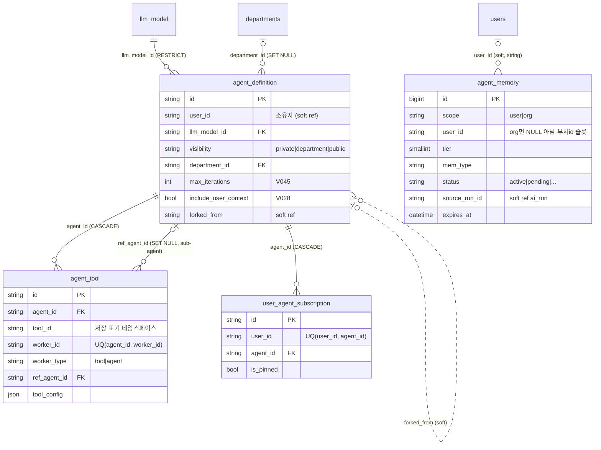

구조는 SQLAlchemy 모델에서 도출(2026-07-21 기준). 실선=실제 FK, 점선=FK 없는 소프트 참조.

## 각주 (코드에 안 보이는 규칙)

- **`agent_tool.tool_id`는 저장 표기다** (`{id}`, `mcp_{srv}`). 카탈로그/폼 표기(`internal:{id}`, `mcp:{srv}:{tool}`)와 다르므로 이 테이블 값을 그대로 UI에 내보내면 안 된다 ([[router-map]] 계약 주의).
- **`forked_from`은 FK가 아니다** — 원본 삭제 시에도 포크 이력 문자열은 남는다.
- **`agent_memory`는 FK가 전혀 없다** (V050 주석: V037 선례 — [[mysql-fk-collation]]). `user_id` 컬럼은 org scope에서 부서 식별자 슬롯으로 재사용되므로, 조회 시 **scope 가드 없이 user_id만으로 필터하면 부서 메모리가 새어 나간다** (agent-memory-org-scope 교훈).
- `agent_memory.status`는 승인 게이트 상태 머신이다: 추출 후보=pending → 승인 시 active (agent-memory-extraction). 행 존재≠주입 대상.
- Phase 2/3 컬럼(scope/tier/status/source_run_id/confidence/expires_at)은 V050에서 **선반영**되어 이후 마이그레이션 0으로 진행됐다 — 확장 예정 컬럼 선반영 패턴의 선례.
- 관련 테이블: `agent_schedule`/`agent_schedule_run`(V038), `agent_skill`(V034) — 에이전트 id 참조 방식은 각 모델 파일 확인.
