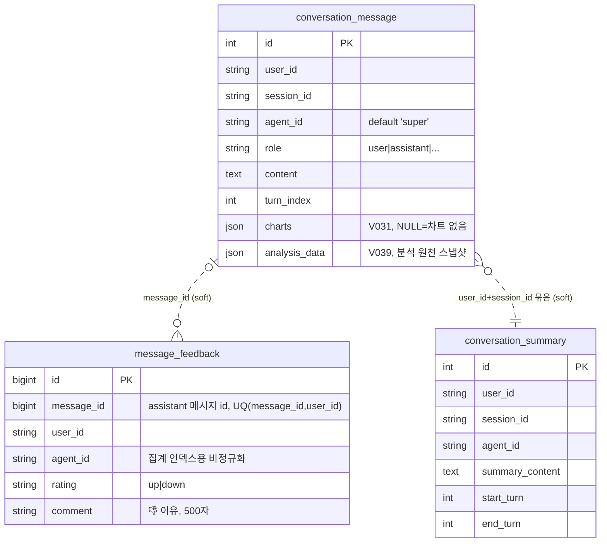

구조는 SQLAlchemy 모델에서 도출(2026-07-21 기준). 이 도메인은 **FK가 하나도 없다** — 전부 소프트 참조.

## 각주 (코드에 안 보이는 규칙)

- **평가 취소 = 행 삭제.** `message_feedback`에는 상태 컬럼이 없고 행 존재 자체가 평가 상태다. 같은 (message_id, user_id) upsert, 취소는 DELETE. 집계 0건은 0%가 아니라 None ([[feedback-toggle-row-delete]]).
- **세션은 테이블이 아니다.** `session_id`는 클라이언트가 발급하는 문자열이며 세션 마스터 테이블이 없다. 세션 목록은 `conversation_message` DISTINCT로 파생된다.
- `message_feedback.message_id`는 FK 없는 소프트 참조 (V052 주석: V037 선례 — [[mysql-fk-collation]]). 평가 UI가 메시지 id를 얻는 경로는 [[streaming-message-action-id]] (스트리밍 완료 이벤트의 additive `assistant_message_id` — [[additive-contract-extension]]).
- `message_feedback.agent_id`는 조인 회피용 비정규화 컬럼이다 (`idx_feedback_agent_rating`으로 에이전트별 만족도 집계).
- 👎 환류 파이프라인은 이 테이블을 기점으로 한다: 이유(comment) 있는 👎만 memory 후보(eval-feedback-loop)·wiki 초안(wiki-feedback-loop)으로 팬아웃, 반복 👎는 빈도 집계로 초안 강화(recurring-feedback-promotion). **이유 없는 👎는 상류에서 차단**된다.
- 대화 기록은 vector DB에 저장 금지 (idt/CLAUDE.md 금지 조항) — 요약은 `conversation_summary`가 담당.
