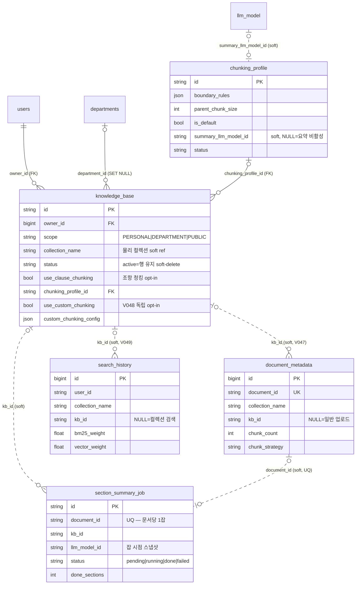

구조는 SQLAlchemy 모델에서 도출(2026-07-21 기준). 실선=실제 FK, 점선=소프트 참조.
실제 청크/벡터는 MySQL이 아니라 ES/Qdrant에 있다 — 여기는 메타데이터 계층만.

## 각주 (코드에 안 보이는 규칙)

- **`kb_id` 소프트 참조 3곳은 의도적으로 FK가 없다.** V047 주석: KB soft-delete와 독립적으로 문서 메타를 남기기 위해서다 (+ FK 시 CHARSET/COLLATE 금지 — [[mysql-fk-collation]]).
- **NULL 의미론이 계약이다**: `document_metadata.kb_id` NULL=일반(비 KB) 업로드, `search_history.kb_id` NULL=컬렉션 단위 검색. backfill은 하지 않기로 결정됨 (kb-management-ui D4).
- **`use_clause_chunking`과 `use_custom_chunking`은 상호배타**지만 DB 제약이 아니라 앱 레이어 검증(V-07)이다. 독립 bool opt-in으로 추가한 이유는 기존 enum 확장 거부 결정 때문 ([[additive-contract-extension]]).
- `chunking_profile.summary_llm_model_id`는 FK 없는 소프트 참조 — NULL이면 섹션 요약 파이프라인 자체가 비활성 (card-section-summary D2).
- `section_summary_job`은 **문서당 1행(UQ)이고 행 존재+status가 곧 요약 진행 상태**다. 재시도는 행 갱신으로 처리된다.
- KB 검색 격리는 이 테이블들이 아니라 Qdrant payload `kb_id` 필터로 실현된다 (kb-rag-filter). E2E 실측은 [[e2e-carryover-checklist]]에 이월 중.
