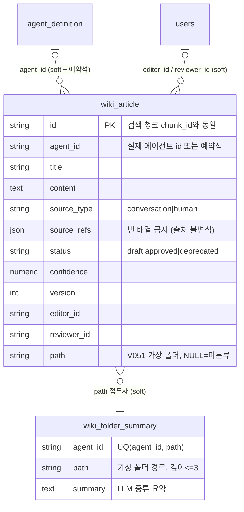

테이블 2개 도메인 (본문 + 폴더 요약 계층). 구조는 SQLAlchemy 모델에서 도출. FK 없음 — 전부 소프트 참조.

## 각주 (코드에 안 보이는 규칙)

- **`agent_id` 예약석**: 실제 에이전트 id 외에 `HUMAN`(소유자 직접 작성, wiki-user-facing)과 `CONVERSATION`(👎 피드백 환류, wiki-feedback-loop)이 들어온다. agent_id로 조인·집계할 때 예약석을 걸러야 한다.
- **출처 불변식**: `source_refs`가 빈 문서는 도메인 레벨에서 생성 불가. 반복 👎 강화(recurring-feedback-promotion)에서는 `len(source_refs)`가 곧 **지지 횟수**로 재해석된다 — refs를 정리(dedup)하면 지지 수가 깨진다.
- **승인 워크플로**: 에이전트 생성/갱신 문서는 항상 draft. 사람이 approve해야 검색에서 우선 노출. approved 문서를 에이전트가 갱신하면 draft로 강등 + version +1. 폐기는 삭제가 아니라 `deprecated` 전환(이력 보존).
- **편집 인가**: `source_type=human`인 문서만 소유자 편집 허용 (wiki-user-facing 결정). 인가 결과는 API가 `can_manage`로 내려준다.
- **검색 연결**: 위키 본문은 Qdrant에도 인덱싱되며 검색 청크의 `chunk_id` = `wiki_article.id`. 근거 배지 → `/knowledge/:articleId` 직결 ([[wiki-screens]]).
- `path`는 V051 additive — 트리 API는 이 컬럼의 접두사 그룹핑(서버 측)으로 만든다. 배포 전 V051 필수 ([[migration-deploy-deps]]).
- distill은 같은 컬렉션 재실행 시 중복 생성 대신 skip한다 (fix-wiki-distill-dedup).
- **`wiki_folder_summary`는 쓰기 시점 증류다** (V053, 기본 off): 승인/편집/폐기 이벤트에서 fire-and-forget 팬아웃으로 해당 path 요약을 LLM 증류하고 상위 폴더로 전파(깊이≤3 → 최대 2단). 질의 시점 비용을 상수로 고정하는 구조 — 목차가 임계(`wiki_toc_max_items=50`) 초과 시에만 폴더 모드로 전환, 이하면 flat 폴백.
- **eventually consistent 계약**: 폴더 요약은 탐색 *힌트*일 뿐, 진실은 `wiki_list(path)`의 실시간 문서 목록이다. 요약이 stale해도 목록 정확성은 보장된다 — 요약을 정합성 근거로 쓰지 말 것. 에이전트 탐색 체인: 최상위 폴더 요약(프롬프트 상주) → `wiki_list`로 폴더 진입 → `wiki_read` 열람.
